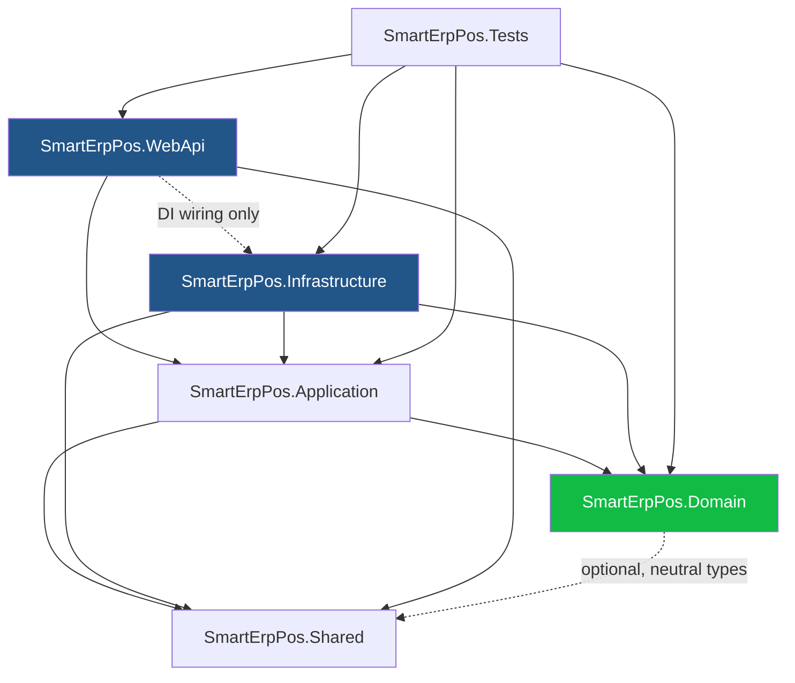
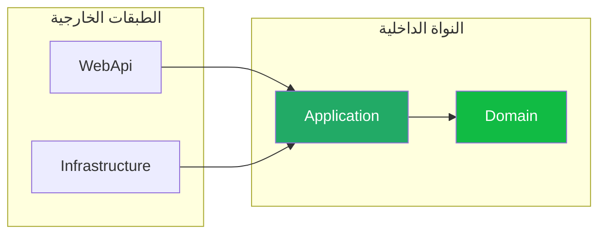
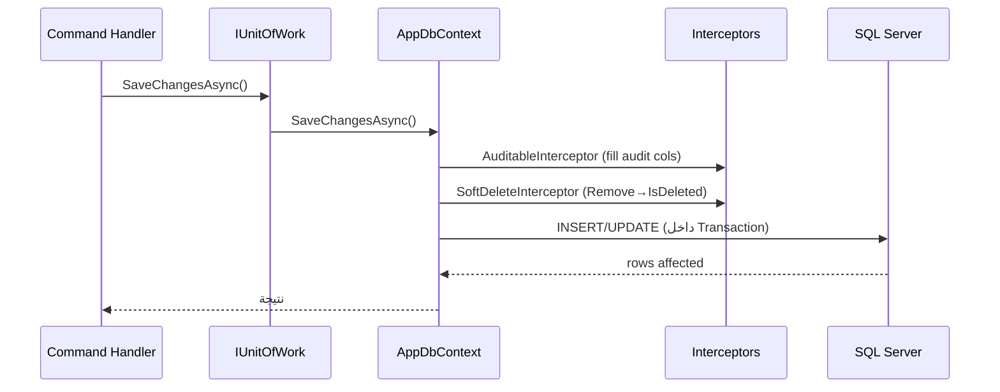
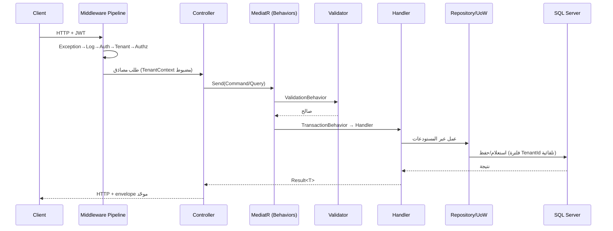
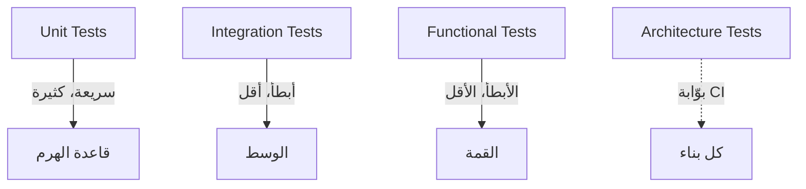

# Solution Architecture Blueprint — Smart ERP POS

> **مخطّط بنية الحل الكامل، عمليّ التوجّه (implementation-oriented)** لمشروع Smart ERP POS على **ASP.NET Core 9 · Clean Architecture · EF Core 9 · SQL Server · CQRS/MediatR · FluentValidation · JWT · Multi-Tenant**.
>
> **بنية فقط — لا ملفات `.cs` ولا كود أعمال.** يبني على: [../02-System-Architecture.md](../02-System-Architecture.md)، [../24-MultiTenant.md](../24-MultiTenant.md)، [../05-Authentication.md](../05-Authentication.md)، [../06-Roles-And-Permissions.md](../06-Roles-And-Permissions.md)، [../04-Database-Design.md](../04-Database-Design.md)، و[../../AI-Prompt/CODING_RULES.md](../../AI-Prompt/CODING_RULES.md).

---

## 1) اسم الحل واصطلاح التسمية النهائي (Solution & Naming Convention)

الحل: **`SmartErpPos.sln`**. المشاريع النهائية:

| المشروع | النوع | الدور |
|---------|------|-------|
| **`SmartErpPos.Domain`** | classlib | النواة — Entities, ValueObjects, Enums, Interfaces |
| **`SmartErpPos.Application`** | classlib | حالات الاستخدام — CQRS, DTOs, Validators, Behaviors |
| **`SmartErpPos.Infrastructure`** | classlib | التنفيذ — EF Core, Repos, Identity, JWT, Tenant |
| **`SmartErpPos.Shared`** | classlib | مشترك محايد — Result, Paging, Constants |
| **`SmartErpPos.WebApi`** | web | الواجهة — Controllers, Middleware, DI, Swagger |
| **`SmartErpPos.Tests`** | xUnit | **مشروع اختبار موحّد** (Unit + Integration + Architecture) بمجلدات داخلية |

```
SmartErpPos.sln
├── src/
│   ├── SmartErpPos.Domain/
│   ├── SmartErpPos.Application/
│   ├── SmartErpPos.Infrastructure/
│   ├── SmartErpPos.Shared/
│   └── SmartErpPos.WebApi/
├── tests/
│   └── SmartErpPos.Tests/
├── Directory.Build.props          (net9.0, Nullable, ImplicitUsings, TreatWarningsAsErrors)
└── Directory.Packages.props       (Central Package Management)
```

> **إعدادات مشتركة (`Directory.Build.props`):** `<TargetFramework>net9.0</TargetFramework>`، `<Nullable>enable</Nullable>`، `<ImplicitUsings>enable</ImplicitUsings>`، `<TreatWarningsAsErrors>true</TreatWarningsAsErrors>`، `<LangVersion>latest</LangVersion>`.

---

## 2) مخطّط اعتماد المشاريع (Project Dependency Diagram)



**مصفوفة الاعتماد (يعتمد على ⟶):**

| ↓ / ⟶ | Domain | Application | Infrastructure | Shared | WebApi |
|-------|:------:|:-----------:|:--------------:|:------:|:------:|
| **Domain** | — | ✗ | ✗ | (اختياري) | ✗ |
| **Application** | ✓ | — | ✗ | ✓ | ✗ |
| **Infrastructure** | ✓ | ✓ | — | ✓ | ✗ |
| **WebApi** | (عبر App) | ✓ | ✓ (DI فقط) | ✓ | — |
| **Tests** | ✓ | ✓ | ✓ | ✓ | ✓ |

---

## 3) قاعدة اعتماد Clean Architecture (The Dependency Rule)



**القاعدة الحاكمة:** الاعتماديات تشير **للداخل دائماً** نحو `Domain`. الطبقة الداخلية لا تعرف الخارجية أبداً.

- **`Domain`** لا يعرف EF Core ولا ASP.NET ولا MediatR — C# نقيّ.
- **`Application`** يعرف `Domain` فقط، ويعرّف **واجهات** لما تحتاجه من الخارج (`ITenantProvider`, `IUnitOfWork`, `IJwtTokenService`).
- **`Infrastructure`** يعتمد على `Application` **ليُنفّذ** واجهاتها — لكن `Application` **لا** يعرف `Infrastructure`؛ يُحقَن التنفيذ في `Program.cs`.
- **`WebApi`** يفوّض كل شيء لـ MediatR؛ يعرف `Infrastructure` لغرض **تسجيل DI فقط**.
- **لا اعتماد دائري إطلاقاً.** يُفرض آلياً عبر **Architecture Tests** (§9).

---

## 4) التنظيم بالميزة داخل Application (Feature-Based Organization)

الطبقة `Application` مُنظّمة بـ **Vertical Slices** — كل وحدة أعمال تملك commands/queries/validators/DTOs الخاصة بها:

```
SmartErpPos.Application/
├── Common/                         (عابر للطبقات — انظر §5)
│   ├── Behaviors/                  (Logging, Validation, Transaction, Caching)
│   ├── Interfaces/                 (ITenantContext, ICurrentUser, IUnitOfWork,
│   │                                IJwtTokenService, IAppDbContext, ICacheService, IDateTime)
│   ├── Mappings/                   (AutoMapper profiles / IMapFrom<T>)
│   ├── Exceptions/                 (ValidationException, NotFoundException, ForbiddenException)
│   └── Models/                     (Result adapters, PagedList — أو من Shared)
│
├── Features/
│   ├── Tenancy/                    (Tenants, Stores, Subscriptions)
│   │   ├── Commands/
│   │   ├── Queries/
│   │   ├── Validators/
│   │   └── Dtos/
│   ├── Identity/                   (Login, RefreshToken, ResetPassword, Roles, Permissions)
│   ├── Catalog/                    (Products, ProductPrices, Categories, Brands, Units)
│   ├── Inventory/                  (Stock, StockMovements, Warehouses, Transfers, Adjustments)
│   ├── Sales/                      (SalesInvoices, SalesReturns, Payments)
│   ├── Purchasing/                 (PurchaseInvoices, PurchaseReturns, POs)
│   └── POS/                        (Shifts, CashDrawer, Suspend/Resume, EndOfDay)
│
└── DependencyInjection.cs          (AddApplication())
```

> **بنية الشريحة الواحدة (use case):** لكل حالة استخدام مجلد يحوي `Command`/`Query` (record) + `Handler` + `Validator` + `Dto`. مثال بنيوي (بلا كود):
> ```
> Features/Catalog/Commands/CreateProduct/
>   ├── CreateProductCommand         (الطلب)
>   ├── CreateProductCommandHandler  (المنطق)
>   ├── CreateProductCommandValidator(التحقق)
>   └── CreateProductResult          (النتيجة الصغيرة)
> ```

### لماذا تملك كل وحدة commands/queries/validators/DTOs الخاصة بها؟

| السبب | التفصيل |
|-------|---------|
| **تماسك عالٍ (High Cohesion)** | كل ما يخصّ "إنشاء منتج" في مكان واحد — الطلب، المنطق، التحقق، الإخراج — لا تشتّت عبر مجلدات تقنية. |
| **قابلية الصيانة** | تعديل ميزة يلمس مجلدها فقط؛ لا تأثير جانبي على وحدات أخرى. |
| **حدود المجال (Bounded Context)** | كل وحدة تعكس حدّاً في المجال (Catalog ≠ Sales)؛ الفصل يمنع التسرّب بين السياقات. |
| **قابلية التوسّع الفريقي** | فِرق مختلفة تعمل على وحدات مختلفة بأقل تعارض في Git. |
| **DTO مملوك للوحدة** | لا DTO عام مشترك ينتفخ؛ كل وحدة تكشف عقودها بما يناسبها ويتطوّر مستقلاً. |
| **حذف/استبدال نظيف** | إزالة ميزة = حذف مجلدها؛ لا بقايا متناثرة. |

---

## 5) أين تعيش الاهتمامات العابرة (Cross-Cutting Concerns)

| الاهتمام | الواجهة (أين تُعرَّف) | التنفيذ (أين يُنفَّذ) | آلية العمل |
|---------|----------------------|----------------------|-----------|
| **Exceptions** | `Application/Common/Exceptions/` (أنواع المجال/التطبيق) + `Shared/Exceptions/` (قاعدة محايدة) | `WebApi/Middleware/ExceptionHandlingMiddleware` | يُحوّل الأخطاء إلى **ProblemDetails** موحّد ([../25-API-Design.md](../25-API-Design.md)) |
| **Logging** | `ILogger<T>` (built-in) + سلوك `LoggingBehavior` في `Application/Common/Behaviors/` | `Infrastructure/Logging/` (إعداد **Serilog** + sinks) | Correlation Id لكل طلب؛ يُسجَّل عبر Pipeline Behavior |
| **Caching** | `ICacheService` في `Application/Common/Interfaces/` + `CachingBehavior` (للـ Queries المؤهّلة) | `Infrastructure/Services/` (in-memory الآن، **Redis** لاحقاً) | استعلامات القراءة القابلة للتخزين تُعلَّم وتُخزَّن؛ إبطال عند الكتابة |
| **CurrentUser** | `ICurrentUser` في `Application/Common/Interfaces/` (UserId, TenantId, StoreIds, Permissions) | `Infrastructure/Identity/CurrentUserService` (يقرأ من `HttpContext`/JWT claims) | scoped لكل طلب |
| **TenantContext** | `ITenantContext` في `Application/Common/Interfaces/` (CurrentTenantId, CurrentStoreId) | `Infrastructure/MultiTenancy/TenantContext` (يُملأ من Middleware) | يُحقَن في `AppDbContext` للفلاتر ([§6](../24-MultiTenant.md)) |
| **Result pattern** | `Result` / `Result<T>` / `Error` في **`SmartErpPos.Shared/Results/`** | — (نوع محايد بلا تنفيذ خارجي) | Handlers ترجع `Result<T>`؛ Controllers تترجمه لـ HTTP status |
| **Auditing** | `IAuditable` في `Domain/Common/` | `Infrastructure/Persistence/Interceptors/AuditableEntityInterceptor` | يملأ Created/Modified/DeletedBy+Date تلقائياً عند `SaveChanges` |

> **قاعدة:** كل اهتمام عابر يُعرَّف كـ **واجهة في الطبقة الداخلية** ويُنفَّذ في الخارجية، ويُدمج غالباً عبر **MediatR Pipeline Behavior** (لا يُبعثر داخل الـ Handlers).

---

## 6) استراتيجية EF Core (EF Core Strategy)

كل شيء في **`Infrastructure/Persistence/`**.

### 6.1 DbContext

- **`AppDbContext`** (Infrastructure) يطبّق واجهة **`IAppDbContext`** (Application) — الـ Handlers تعتمد على الواجهة لا على الصنف الملموس.
- يُحقَن فيه `ITenantContext` و`ICurrentUser` لتطبيق الفلاتر والتدقيق.
- يسجّل الـ Interceptors ويطبّق كل الـ Configurations عبر `ApplyConfigurationsFromAssembly`.

### 6.2 Entity Configurations

- **`IEntityTypeConfiguration<T>`** لكل كيان في `Persistence/Configurations/{Module}/` — **Fluent API حصراً**.
- **لا Data Annotations لـ EF في `Domain`** — النواة تبقى نقيّة.
- كل Configuration تحدّد: PK, FKs (`ON DELETE NO ACTION`), Indexes (فهرس العزل + الباركود...), الدقّة (`decimal(18,4)`), `ROWVERSION`, وحدود الأعمدة.

### 6.3 Interceptors

| Interceptor | الغرض |
|-------------|-------|
| **`AuditableEntityInterceptor`** | يملأ `CreatedBy/Date`, `ModifiedBy/Date` من `ICurrentUser` + `IDateTime` عند `SaveChanges` |
| **`SoftDeleteInterceptor`** | يحوّل `Remove()` على `ISoftDeletable` إلى `IsDeleted=1` + `DeletedBy/Date` بدل حذف فعلي |
| **`DispatchDomainEventsInterceptor`** *(اختياري)* | ينشر Domain Events بعد الحفظ الناجح |

### 6.4 Global Query Filters

في `AppDbContext.OnModelCreating`، يُطبَّق ديناميكياً على كل كيان:

```
ITenantOwned  →  e.TenantId == _tenantContext.CurrentTenantId
ISoftDeletable →  !e.IsDeleted
```

- يُبنى الفلتر عبر انعكاس (reflection) على الكيانات المطبِّقة للواجهتين.
- **جداول Platform** (`Tenants`, `Subscriptions`, `SubscriptionPayments`) مستثناة من فلتر المستأجر (يملكها Super Admin).
- **طبقة دفاع ثانية:** SQL Server **RLS** عبر `SESSION_CONTEXT` ([../27-Security.md](../27-Security.md)).

### 6.5 Soft Delete

- كل جدول أعمال يطبّق `ISoftDeletable` (`IsDeleted`, `DeletedBy`, `DeletedDate`).
- الحذف الفعلي ممنوع لجداول الأعمال؛ يمرّ عبر الـ Interceptor.
- الاستعلامات تستبعد المحذوف تلقائياً عبر Global Query Filter + فهارس مُرشَّحة `WHERE IsDeleted=0`.

### 6.6 Auditing

- `IAuditable` + `AuditableEntityInterceptor` يملآن أعمدة التدقيق تلقائياً.
- سجلّ تدقيق منفصل (`AuditLogs`) للعمليات الحسّاسة (تغيير سعر، ترحيل فاتورة، انتقال حالة اشتراك) — يُكتب عبر behavior/handler مخصّص لا الـ interceptor.

### 6.7 تدفّق الحفظ (Save Pipeline)



---

## 7) اتفاقيات طبقة الـ API (WebApi Conventions)

```
SmartErpPos.WebApi/
├── Controllers/v1/                 (Products, Sales, Auth, Platform/Subscriptions ...)
├── Middleware/                     (ExceptionHandling, TenantResolution, RequestLogging)
├── Auth/                           (Policies, [HasPermission] wiring)
├── Extensions/                     (AddWebApi, UsePipeline)
├── Program.cs                      (Composition Root)
└── appsettings.{Environment}.json
```

| الجانب | الاتفاقية |
|--------|-----------|
| **Controllers** | رفيعة — تُنشئ Command/Query وتُرسله عبر `ISender` (MediatR) وتترجم `Result` إلى HTTP. **لا منطق أعمال، لا `DbContext`.** |
| **Middleware** | ترتيب: `ExceptionHandling` → `RequestLogging`(+correlation) → `Authentication` → `TenantResolution` → `Authorization`. |
| **Authentication** | **JWT Bearer**؛ الـ token يحمل `sub`, `tenant_id`, `store_ids`, `roles`, `permissions`. عمر قصير + Refresh Token مُدوَّر ([../05-Authentication.md](../05-Authentication.md)). |
| **Authorization** | **Permission-Based** عبر `[HasPermission("Resource.Action")]` + `PermissionAuthorizationHandler` + `IAuthorizationPolicyProvider` ديناميكي ([../06-Roles-And-Permissions.md](../06-Roles-And-Permissions.md)). |
| **Swagger** | `Swashbuckle`؛ توثيق لكل إصدار، تعريف أمان JWT (Bearer)، أمثلة، تجميع حسب الوحدة. |
| **Versioning** | `Asp.Versioning`؛ مسار `/api/v1/...`؛ سياسة إهمال (deprecation) واضحة؛ Swagger لكل إصدار. |
| **Response envelope** | موحّد `{ success, data, errors, meta }` مع pagination/filtering/sorting قياسي ([../25-API-Design.md](../25-API-Design.md)). |

### تدفّق طلب كامل (Request Flow)



---

## 8) الهوية وتعدّد المستأجرين — ملخّص الوضع (Identity & Multi-Tenancy Placement)

> التفاصيل الكاملة في [../24-MultiTenant.md](../24-MultiTenant.md) و[../05-Authentication.md](../05-Authentication.md). هنا مواضع التنفيذ فقط.

| المكوّن | الواجهة | التنفيذ |
|---------|---------|---------|
| Tenant resolution | `ITenantContext` (Application) | `Infrastructure/MultiTenancy/` (Middleware + Resolvers: JWT → Subdomain → Custom Domain → Header) |
| JWT | `IJwtTokenService` (Application) | `Infrastructure/Identity/JwtTokenService` |
| Refresh tokens | `IRefreshTokenService` (Application) | `Infrastructure/Identity/` (rotation + reuse detection، مُجزَّأ SHA-256) |
| Permissions | `[HasPermission]` (WebApi) | `Infrastructure/Identity/PermissionAuthorizationHandler` |
| Store isolation | `ICurrentUser.AllowedStoreIds` | فلترة `StoreId ∈ allowedStores` على مستوى الاستعلام/الصلاحية |

---

## 9) استراتيجية الاختبار (Testing Strategy)

كل الاختبارات في **`SmartErpPos.Tests`** بمجلدات مفصولة حسب النوع:

```
SmartErpPos.Tests/
├── Unit/                   (Domain invariants, Validators, Handlers بـ mocks)
├── Integration/            (EF Core + SQL Server عبر Testcontainers، Repos, Migrations)
├── Functional/             (WebApplicationFactory — endpoints end-to-end)
└── Architecture/           (فرض قواعد الطبقات آلياً)
```

| النوع | النطاق | الأدوات | أمثلة |
|-------|--------|---------|-------|
| **Unit Tests** | منطق نقيّ بلا I/O | `xUnit` + `FluentAssertions` + `NSubstitute`/`Moq` | ثوابت المجال (منع الرصيد السالب)، Validators، Handlers مع mocks |
| **Integration Tests** | تكامل حقيقي مع DB | `Testcontainers` (SQL Server) أو `EFCore.InMemory` للسريع | Repos، Global Query Filters (عزل المستأجر فعلياً)، Interceptors، Migrations تعمل |
| **Architecture Tests** | فرض قاعدة الاعتماد | `NetArchTest.Rules` أو `ArchUnitNET` | `Domain` لا يعتمد على EF/ASP.NET؛ Controllers لا تلمس `DbContext`؛ اتجاه الاعتماد سليم؛ لا اعتماد دائري |
| **Functional Tests** *(اختياري ضمن نفس المشروع)* | HTTP end-to-end | `Microsoft.AspNetCore.Mvc.Testing` | تسجيل دخول → إنشاء منتج → استعلام، بـ JWT حقيقي |

**اختبارات عزل المستأجر (حرجة):** ضمن Integration — تتأكّد أن استعلامات مستأجر لا تُرجع بيانات مستأجر آخر، حتى مع محاولة تجاوز الفلتر (دفاع RLS).



---

## 10) حزم NuGet (Central Package Management)

تُدار مركزياً عبر `Directory.Packages.props`، بإصدارات متوافقة مع **.NET 9**:

| المشروع | الحزم |
|---------|-------|
| **Application** | `MediatR`, `FluentValidation.DependencyInjectionExtensions`, `AutoMapper.Extensions.Microsoft.DependencyInjection` |
| **Infrastructure** | `Microsoft.EntityFrameworkCore.SqlServer`, `Microsoft.EntityFrameworkCore.Design`, `Microsoft.AspNetCore.Identity.EntityFrameworkCore`, `Microsoft.AspNetCore.Authentication.JwtBearer`, `Serilog.AspNetCore`, `Hangfire.AspNetCore`, `Hangfire.SqlServer` |
| **WebApi** | `Swashbuckle.AspNetCore`, `Asp.Versioning.Mvc`, `Asp.Versioning.Mvc.ApiExplorer` |
| **Shared** | (محايد — بلا حزم خارجية قدر الإمكان) |
| **Tests** | `xUnit`, `FluentAssertions`, `NSubstitute`, `Testcontainers.MsSql`, `Microsoft.AspNetCore.Mvc.Testing`, `NetArchTest.Rules` |

---

## 11) اصطلاحات الترميز (ملخّص)

> المرجع الكامل [../../AI-Prompt/CODING_RULES.md](../../AI-Prompt/CODING_RULES.md).

- **التسمية:** `SmartErpPos.{Layer}`؛ Entities مفرد PascalCase؛ `I`+واجهة؛ `...Command`/`...Query`/`...Handler`/`...Validator`/`...Dto`؛ `...Async` للـ async.
- **CQRS:** Command يكتب ويرجع نتيجة صغيرة، Query يقرأ ويرجع DTO — لا خلط. Behaviors بالترتيب: Logging → Validation → Transaction → Handler.
- **الكيانات:** ترث `BaseEntity` (11 عمود مشترك)؛ لا Annotations لـ EF في Domain؛ `long` للمفاتيح، `decimal(18,4)` للأموال، UTC للتواريخ، Soft Delete، `ROWVERSION`.
- **قاعدة البيانات:** `TenantId` + Global Filter؛ فهرس عزل `(TenantId, StoreId)` مُرشَّح؛ FK صريحة `NO ACTION`؛ Transactions عبر UoW؛ JSON للإعدادات فقط.

---

## 12) الخطوة التالية — بانتظار الموافقة (Next Step)

هذا المستند **بنية فقط** — لا ملفات `.cs` ولا كيانات.

**التسلسل المقترح بعد موافقتك:**
1. إنشاء `.sln` + المشاريع الفارغة + مراجع الاعتماد + `Directory.Build.props` / `Directory.Packages.props`.
2. `BaseEntity` + الواجهات المشتركة (`ITenantOwned`, `ISoftDeletable`, `IAuditable`) في Domain.
3. `AppDbContext` + `ITenantContext` + Interceptors + Global Query Filters (بلا كيانات أعمال بعد).
4. الكيانات وحدةً وحدة، ثم CQRS لكل وحدة.
5. WebApi: Middleware pipeline + JWT + أول Controller.
6. **Architecture Tests** أولاً لتثبيت القواعد قبل نموّ الكود.

> **⏸ توقّف هنا. لا كيانات ولا كود حتى الموافقة.**
