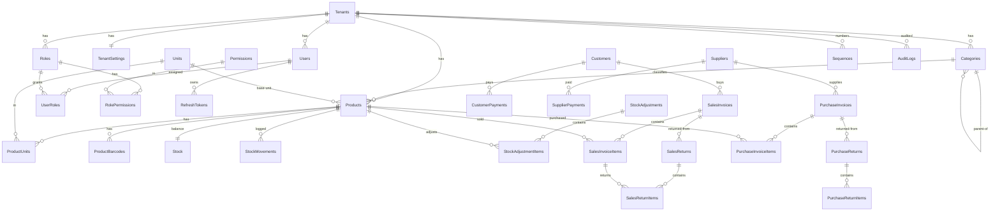

# 07 — ERD & Relationships (المخطّط والعلاقات)

> مخطّط العلاقات بين جداول النواة، وكل قيود المفاتيح الخارجية، وقواعد الحذف. يلتزم بـ [06-Tables-Definitions.md](06-Tables-Definitions.md). **كل الحذف soft، لذا كل FK بـ `ON DELETE NO ACTION`.**

---

## 1) مخطّط ERD — نظرة كلّية (Mermaid)



---

## 2) مخطّط ASCII — المجموعات والعلاقات المحورية

```
                              ┌─────────────┐
                              │   Tenants   │  (الجذر — لا TenantId)
                              │ Status: 1/2/3│
                              └──────┬──────┘
              ┌──────────────────────┼───────────────────────────┐
              ▼                      ▼                            ▼
      ┌──────────────┐      ┌────────────────┐          ┌─────────────────┐
      │ TenantSettings│      │     Users      │          │  (كل جداول       │
      │  (1:1)        │      │  N:1 → Tenant  │          │   الأعمال تحمل   │
      └──────────────┘      └───────┬────────┘          │   TenantId)      │
                                    │                    └─────────────────┘
                        ┌───────────┼───────────┐
                        ▼           ▼           ▼
                   UserRoles   RefreshTokens  (audit source)
                        │
                        ▼
                     Roles ──< RolePermissions >── Permissions

  ── Catalog ────────────────────────────────────────────────────────────
   Categories ──(self parent)──┐
        │ classifies           │
        ▼                       │
     Products ──< ProductUnits >── Units
        │  │  └──< ProductBarcodes
        │  └─────────────────────────► Stock (1:1)  +  StockMovements (1:N, append-only)
        │
  ── Sales ──────────────────────────────────────────────────────────────
   Customers ──< SalesInvoices ──< SalesInvoiceItems ──(Product)
                      │                    ▲
                      ▼                    │ (البند الأصلي المُرجَع منه)
                 SalesReturns ──< SalesReturnItems ─┘

  ── Purchases ──────────────────────────────────────────────────────────
   Suppliers ──< PurchaseInvoices ──< PurchaseInvoiceItems ──(Product)
                      │
                      ▼
              PurchaseReturns ──< PurchaseReturnItems
```

---

## 3) جدول العلاقات الكامل (Relationship Matrix)

| # | العلاقة (Child → Parent) | النوع | FK | قاعدة الحذف |
|---|--------------------------|:-----:|-----|:-----------:|
| 1 | `Users.TenantId` → `Tenants.Id` | N:1 | `FK_Users_Tenant` | NO ACTION |
| 2 | `TenantSettings.TenantId` → `Tenants.Id` | 1:1 | `FK_TenantSettings_Tenant` | NO ACTION |
| 3 | `Roles.TenantId` → `Tenants.Id` | N:1 | `FK_Roles_Tenant` | NO ACTION |
| 4 | `UserRoles.UserId` → `Users.Id` | N:1 | `FK_UserRoles_User` | NO ACTION |
| 5 | `UserRoles.RoleId` → `Roles.Id` | N:1 | `FK_UserRoles_Role` | NO ACTION |
| 6 | `RolePermissions.RoleId` → `Roles.Id` | N:1 | `FK_RolePermissions_Role` | NO ACTION |
| 7 | `RolePermissions.PermissionId` → `Permissions.Id` | N:1 | `FK_RolePermissions_Permission` | NO ACTION |
| 8 | `RefreshTokens.UserId` → `Users.Id` | N:1 | `FK_RefreshTokens_User` | NO ACTION |
| 9 | `Categories.ParentId` → `Categories.Id` | N:1 (self) | `FK_Categories_Parent` | NO ACTION |
| 10 | `Categories.TenantId` → `Tenants.Id` | N:1 | `FK_Categories_Tenant` | NO ACTION |
| 11 | `Products.CategoryId` → `Categories.Id` | N:1 | `FK_Products_Category` | NO ACTION |
| 12 | `Products.BaseUnitId` → `Units.Id` | N:1 | `FK_Products_BaseUnit` | NO ACTION |
| 13 | `ProductUnits.ProductId` → `Products.Id` | N:1 | `FK_ProductUnits_Product` | NO ACTION |
| 14 | `ProductUnits.UnitId` → `Units.Id` | N:1 | `FK_ProductUnits_Unit` | NO ACTION |
| 15 | `ProductBarcodes.ProductId` → `Products.Id` | N:1 | `FK_ProductBarcodes_Product` | NO ACTION |
| 16 | `Stock.ProductId` → `Products.Id` | 1:1 | `FK_Stock_Product` | NO ACTION |
| 17 | `StockMovements.ProductId` → `Products.Id` | N:1 | `FK_StockMovements_Product` | NO ACTION |
| 18 | `StockAdjustmentItems.StockAdjustmentId` → `StockAdjustments.Id` | N:1 | `FK_StockAdjItems_Adj` | NO ACTION |
| 19 | `StockAdjustmentItems.ProductId` → `Products.Id` | N:1 | `FK_StockAdjItems_Product` | NO ACTION |
| 20 | `CustomerPayments.CustomerId` → `Customers.Id` | N:1 | `FK_CustPay_Customer` | NO ACTION |
| 21 | `SupplierPayments.SupplierId` → `Suppliers.Id` | N:1 | `FK_SupPay_Supplier` | NO ACTION |
| 22 | `SalesInvoices.CustomerId` → `Customers.Id` | N:1 (nullable) | `FK_SalesInv_Customer` | NO ACTION |
| 23 | `SalesInvoiceItems.SalesInvoiceId` → `SalesInvoices.Id` | N:1 | `FK_SalesItems_Invoice` | NO ACTION |
| 24 | `SalesInvoiceItems.ProductId` → `Products.Id` | N:1 | `FK_SalesItems_Product` | NO ACTION |
| 25 | `SalesReturns.SalesInvoiceId` → `SalesInvoices.Id` | N:1 | `FK_SalesRet_Invoice` | NO ACTION |
| 26 | `SalesReturnItems.SalesReturnId` → `SalesReturns.Id` | N:1 | `FK_SalesRetItems_Return` | NO ACTION |
| 27 | `SalesReturnItems.SalesInvoiceItemId` → `SalesInvoiceItems.Id` | N:1 | `FK_SalesRetItems_InvItem` | NO ACTION |
| 28 | `PurchaseInvoices.SupplierId` → `Suppliers.Id` | N:1 | `FK_PurchInv_Supplier` | NO ACTION |
| 29 | `PurchaseInvoiceItems.PurchaseInvoiceId` → `PurchaseInvoices.Id` | N:1 | `FK_PurchItems_Invoice` | NO ACTION |
| 30 | `PurchaseReturns.PurchaseInvoiceId` → `PurchaseInvoices.Id` | N:1 | `FK_PurchRet_Invoice` | NO ACTION |
| * | كل `{Table}.TenantId` → `Tenants.Id` | N:1 | `FK_{Table}_Tenant` | NO ACTION |

---

## 4) قاعدة الحذف الحاكمة (No Cascade Delete)

```
❌ ممنوع:  ON DELETE CASCADE   (يمحو بيانات مالية بالخطأ)
❌ ممنوع:  ON DELETE SET NULL  (يفكّ ارتباطات محاسبية)
✅ إلزامي: ON DELETE NO ACTION (كل FK)
```

**لماذا:** الحذف في SmartApp **soft دائماً** (`IsDeleted = 1`). لا يُحذَف صفّ فعلياً من جداول الأعمال، فلا حاجة لأي سلوك تتالٍ. محاولة حذف أب مرتبط بأبناء تُمنَع منطقياً في طبقة `Application` (فحص التبعيات قبل السماح بالحذف الناعم).

**آثار جانبية مقصودة:**
- لا يمكن حذف `Category` مرتبطة بمنتجات → يُرفض في الـ Handler برسالة واضحة.
- لا يمكن حذف `Product` له حركات مخزون → يُرفض؛ يُعطَّل (`IsActive=0`) بدلاً من الحذف.
- `SalesInvoice` لا تُحذَف بعد التأكيد → تُلغى (`Status=Cancelled`) مع أثر عكسي على المخزون.

---

## 5) العلاقات المحورية (Critical Relationships)

### 5.1 المرتجع يشير للأصل (Return → Original)

```
SalesReturnItems.SalesInvoiceItemId ──► SalesInvoiceItems.Id
```
كل بند مرتجع **يشير للبند الأصلي** ويجمّد سعره منه. هذا يضمن أن المرتجع بالسعر الأصلي حتى لو تغيّر سعر المنتج. `SalesInvoiceItems.ReturnedQty` يمنع الإرجاع الزائد (`CHECK ReturnedQty <= Quantity`).

### 5.2 الرصيد مقابل الحركات (Stock vs Movements)

```
Stock            = الرصيد الحالي (صف واحد لكل منتج — قابل للتحديث)
StockMovements   = سجل كل حركة (Append-Only — لا يُعدَّل)
```
`Stock.QuantityOnHand` و`Stock.AverageCost` تُحدَّثان مع كل حركة، لكن الحركة نفسها تُسجَّل بـ snapshot (`BalanceAfter`, `AvgCostAfter`) في `StockMovements` كأثر دائم. إعادة بناء الرصيد ممكنة من مجموع الحركات (تدقيق).

### 5.3 التصنيف الشجري (Self-Reference)

```
Categories.ParentId ──► Categories.Id
```
منع الحلقات (Cycles) يُفرَض في طبقة `Application` عند التعيين (تصنيف لا يكون أباً لنفسه أو لأحد أسلافه).

---

## 6) العلاقات مع جدول `Tenants`

كل جداول الأعمال ترتبط بـ `Tenants` عبر `TenantId` (FK). لكن:

- الفلترة الفعلية للعزل تتمّ عبر **EF Core Global Query Filter** لا عبر الـ FK.
- الـ FK هنا لـ **سلامة مرجعية** (لا يوجد صفّ بمستأجر غير موجود)، لا للعزل.
- `Tenants` نفسه لا يحمل `TenantId` (هو الجذر).
- `Permissions` مرجعي عالمي (لا `TenantId`).

---

## 7) ملاحظات على قابلية إضافة الفروع (Future `StoreId`)

عند دعم الفروع مستقبلاً، تُضاف علاقة جديدة **انتقائياً** (لا لكل الجداول):

```
Stock.StoreId          ──► Stores.Id   (جديد)
SalesInvoices.StoreId  ──► Stores.Id
PurchaseInvoices.StoreId──► Stores.Id
StockMovements.StoreId ──► Stores.Id
```

`Stores.TenantId → Tenants.Id`. يبقى `TenantId` حدّ العزل؛ `StoreId` تقسيم تشغيلي. لا يُلمَس باقي الجداول.

---

_يُكمّله [08-Indexing-Strategy.md](08-Indexing-Strategy.md) (الفهارس على هذه العلاقات) و[06-Tables-Definitions.md](06-Tables-Definitions.md) (تعريف الأعمدة)._
